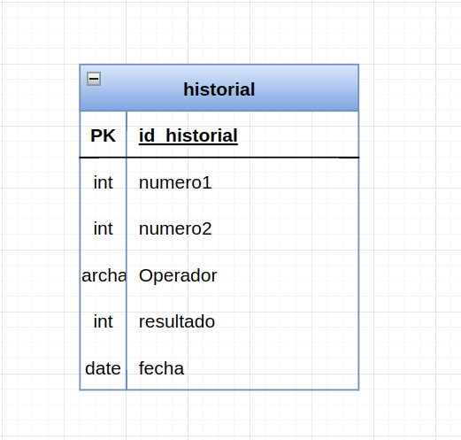
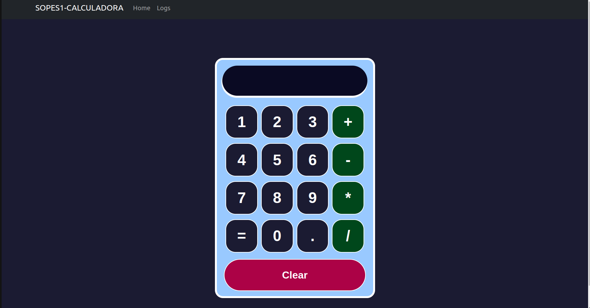
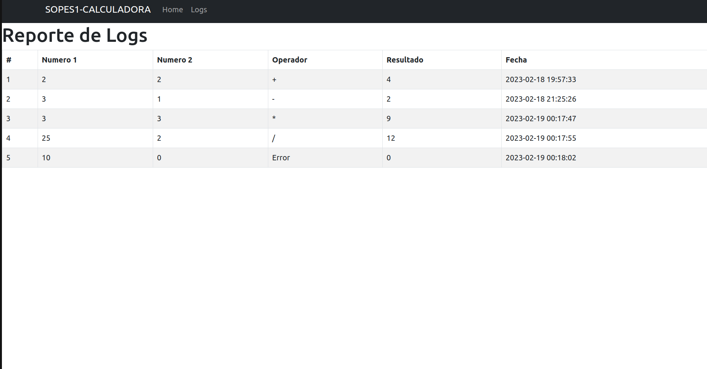

# DATOS

Hector Orozco 
201314296

# PRACTICA 1

## Estructura
- Base de datos - Mysql
- Backend (Golang)
- Frotend (React)
- Docker 


## Base de datos 
- Mysql (latest docker)
- Imagen: https://hub.docker.com/_/mysql 


## Backend
- lenguaje: Golang
- Version: 1.19

modulos:
- sql driver/mysql
- gorilla mux
- joho/godotenv


Endpoints:
- suma
- resta
- multiplicacion
- division
- historial

puerto:
- 4000


## Frontend
lenguaje: Recat

Routas:
- Home
- Logs

extras:
- react boostrap

puerto:
- 3000





## Run 
para el arranque de la aplicacion se tiene implementado cada apartado de la aplicacion con docker lo cual permite tener la aplicacion modularzada, para levantar la app en conjunto se tiene un archivo docker-compose en su version "3.8"


```
Estructura:
|- Backend
|------Dockerfile 
|- Frontend 
|------Dockerfile
- docker-compose
```